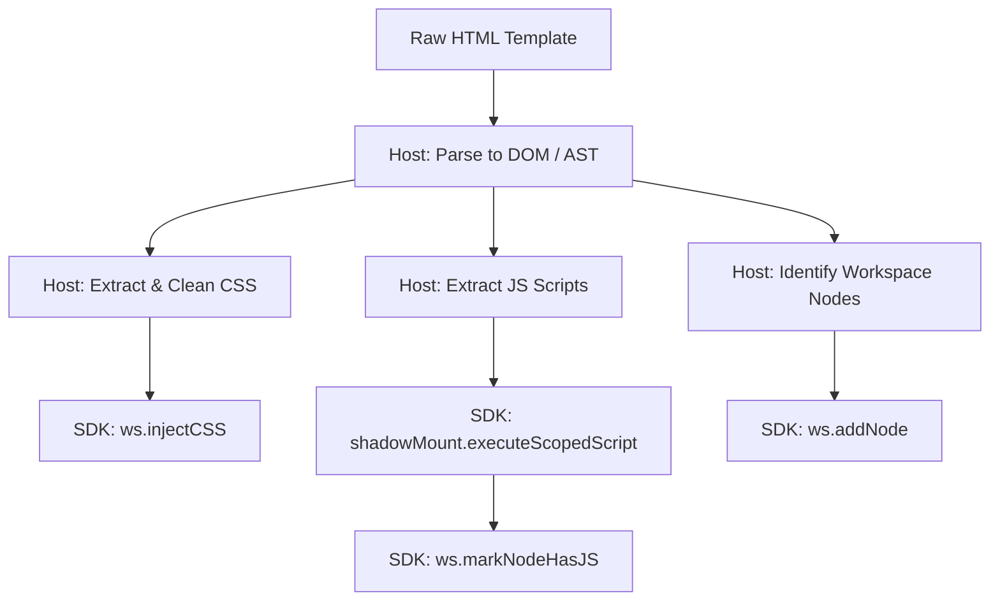

# HTML/CSS Document Importing

With Canvus SDK's **host-driven architecture**, the SDK acts as a **dumb canvas** workspace. It does not contain a built-in HTML parser, CSS parser, or automatic script execution hook. Instead, HTML template parsing, stylesheet resolution, script sandboxing, and JS presence detection are the **host application's responsibility**.

This guide outlines the standard workflow for importing content documents into the Canvus workspace.

---

## The Host-Driven Importing Workflow



To mount an HTML page/template:
1. **Parse the template**: Load and parse the HTML string using a DOM parser (like `DOMParser` in the browser or `jsdom` in a Node environment).
2. **Inject CSS**: Extract style blocks or external stylesheet links and inject them into the workspace.
3. **Register Nodes**: Identify the interactive layout containers or elements, construct `WebHTMLNode` objects, and register them.
4. **Execute & Mark JS**: Extract interactive script behaviors, execute them inside the shadow scope, and explicitly flag nodes containing scripts.

---

## Code Example

Below is a complete, real-world example of how a host application implements this importing workflow using the Canvus SDK:

```typescript
import { Workspace } from 'canvus';

const container = document.getElementById('workspace-container');
const ws = new Workspace(container, {
  onHTMLCommit(id, html) {
    console.log(`Node ${id} committed updated markup:`, html);
  }
});

// 1. Raw HTML Document to Import
const rawHTML = `
  <!DOCTYPE html>
  <html>
    <head>
      <style>
        .card { padding: 20px; background: #fff; border-radius: 8px; }
        .btn { background: #6366f1; color: white; border: none; }
      </style>
    </head>
    <body>
      <div id="card-1" class="card">
        <h2 id="title-1">Hello World</h2>
        <button id="btn-1" class="btn">Click Me</button>
      </div>
      <script>
        const button = document.getElementById('btn-1');
        button.addEventListener('click', () => alert('Hello!'));
      </script>
    </body>
  </html>
`;

// 2. Parse HTML string in the Host
const parser = new DOMParser();
const doc = parser.parseFromString(rawHTML, 'text/html');

// 3. Extract and Inject Stylesheets
const styles = Array.from(doc.querySelectorAll('style'))
  .map(style => style.textContent)
  .filter(Boolean)
  .join('\n');

if (styles) {
  // injectCSS automatically rewrites :root, html, and body selectors to :host
  ws.injectCSS(styles);
}

// 4. Register Workspace Nodes
// Define which elements are treated as interactive content nodes
const cardNode = {
  id: 'card-1',
  rawMarkup: `<div class="card"><h2 id="title-1">Hello World</h2><button id="btn-1" class="btn">Click Me</button></div>`,
  currentRect: { x: 50, y: 50, width: 300, height: 120 }
};

// Mount the node into the workspace
ws.addNode(cardNode);

// 5. Extract and Execute Guest Scripts
const scripts = Array.from(doc.querySelectorAll('script'))
  .map(script => script.textContent)
  .filter(Boolean);

for (const scriptCode of scripts) {
  // Execute script in the context of the workspace shadow DOM mount
  ws.getShadowMount().executeScopedScript(scriptCode);
}

// 6. Explicitly Flag JavaScript Nodes
// Let the Workspace know which nodes have interactive JS logic so it draws the JS badge
ws.markNodeHasJS('card-1');
```

---

## Isolation & Stylesheet Rewriting

When you call `ws.injectCSS(css)`, the SDK performs a minimal selector rewriting step:
- Rules matching `:root`, `html`, or `body` are rewritten to `:host`.
- Other rules remain unmodified, as they are fully isolated inside the workspace's open Shadow DOM.

This ensures that the template's styles target the viewport root inside the Shadow DOM and do not bleed out into your editor UI.
