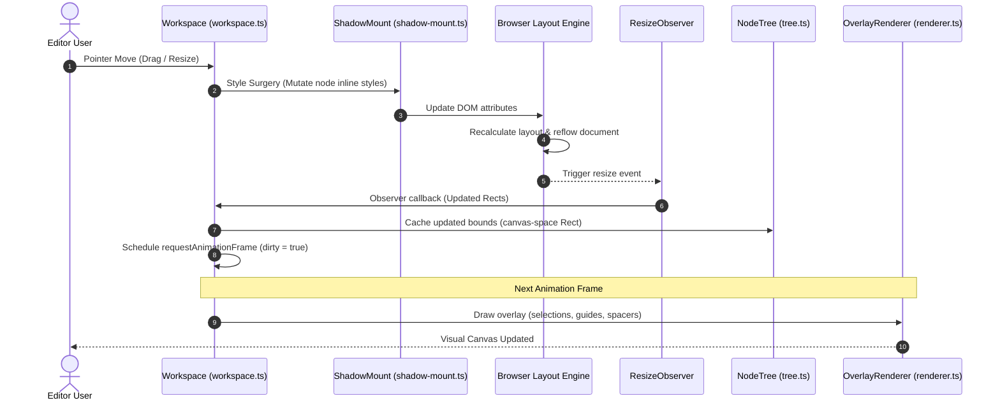

# Architecture & Reflow Loop

Canvus is engineered around a **Twin-Layer Architecture** designed to solve style leakage, script pollution, and layout synchronization without the performance overhead or communication barriers of nesting `<iframe>` documents.

---

## 1. The Twin-Layer Architecture

Instead of isolating third-party code in an iframe, the workspace overlays two specialized visual layers inside a relative container:

```
  +--------------------------------------------------------+
  |              Viewport Surface Layer (Canvas)           |
  |  - Selection highlights, grab anchors, guidelines      |
  |  - Spacing adjuster overlays, drag indicators          |
  +--------------------------------------------------------+
                             |
                             v  (Layered transparently over Shadow DOM)
  +--------------------------------------------------------+
  |           Projection Mutation Layer (Shadow DOM)       |
  |  - Raw HTML content mounted inside open Shadow Root    |
  |  - Isolated Stylesheets (Tailwind, custom CSS)        |
  |  - Browser native layout reflow calculations           |
  +--------------------------------------------------------+
```

### A. The Projection Mutation Layer (Shadow DOM)
Managed by [`ShadowMount`](file:///Users/balfaro01/Documents/GitHub/canvus/src/shadow-mount.ts). It injects the user's raw HTML/CSS inside an isolated browser `ShadowRoot` in `"open"` mode.
*   **Style Isolation**: A reset stylesheet (`SHADOW_RESET_CSS`) isolates the inner DOM tree, preventing host CMS or editor dashboard styles from bleeding into the preview.
*   **Native Reflows**: Rather than using a custom JavaScript-based CSS layout engine, the browser's native C++ layout engine handles Flexbox wrapping, grid track auto-sizing, margins, and text wraps.
*   **Node Wrappers**: Each registered content node is surrounded by a light wrapper (`.canvus-node-wrapper`) that handles absolute or flow positioning.

### B. The Viewport Surface Layer (HTML5 Canvas)
Managed by [`OverlayRenderer`](file:///Users/balfaro01/Documents/GitHub/canvus/src/renderer.ts). A transparent HTML5 Canvas is placed on top of the Shadow DOM, scaling and panning in perfect coordination with it.
*   **Visual Indicators**: Draws selections, resize anchors, spacing adjuster handles (margin/padding spacers), snap guidelines, and hover borders.
*   **Coordinate Space**: Operates in **canvas-space** (world coordinates). It draws geometries derived from coordinate transformations (zoom/pan matrix).

---

## 2. The Synchronous Reflow Loop

To keep interactions lag-free, Canvus runs a same-thread, frame-synchronous reflow loop driven by pointer interactions:



### Breakdown of the Loop Phases:
1.  **Style Surgery**: When the user drags spacing adjusters or resizes a node, the [`Workspace`](file:///Users/balfaro01/Documents/GitHub/canvus/src/workspace.ts) directly mutates the inline CSS styles on the target wrapper element or content node.
2.  **Browser Reflow**: The browser immediately recalculates sizes, padding reflows, wrapping, and grid layouts.
3.  **Observer Callback**: A single shared `ResizeObserver` monitors the wrapper components. Once the browser finishes the reflow, the observer fires callback events containing the updated bounding client rectangles.
4.  **Tree Cache Update**: The workspace translates these screen-space client bounds into **canvas-space** coordinates (using coordinate matrices in [`matrix.ts`](file:///Users/balfaro01/Documents/GitHub/canvus/src/matrix.ts)) and caches them inside the `NodeTree` model.
5.  **rAF-Throttled Redraw**: To prevent layout thrashing and maintain 60/120Hz refresh rates, the workspace marks itself as dirty. In the next `requestAnimationFrame` tick, the canvas overlay reads cached rectangles, evaluates snapping guidelines, and draws all outline decorations.

---

## 3. Module Roles Blueprint

The `src/` codebase divides responsibilities among the following modules:

*   **[`types.ts`](file:///Users/balfaro01/Documents/GitHub/canvus/src/types.ts)**: *Canonical Types & Primitives*. Contains structural definitions for vectors (`Vec2`), rectangles (`Rect`), transform matrices (`ViewportMatrix`), operations payloads (`Operation`), and drag state machine states.
*   **[`matrix.ts`](file:///Users/balfaro01/Documents/GitHub/canvus/src/matrix.ts)**: *Stateless Coordinate Math*. Translates vectors and rects between **Screen space** (DOM client pixels) and **Canvas space** (scale-and-translate coordinates). Handles hit testing, pan accumulation, and zoom anchoring to prevent cursor drift.
*   **[`shadow-mount.ts`](file:///Users/balfaro01/Documents/GitHub/canvus/src/shadow-mount.ts)**: *Shadow DOM Director*. Injects and destroys wrapper elements, mounts styles, suppresses resize observer feedback loops, and isolates CSS. Houses the **Flat String Bridge** (`extractHTML`) to export clean, SDK-free HTML fragments.
*   **[`tree.ts`](file:///Users/balfaro01/Documents/GitHub/canvus/src/tree.ts)**: *Hierarchical Tree model*. Manages the logical `NodeTree` structure (`parentId`, `childIds`, `depth`). Coordinates sibling sequences and performs ancestor-walk cycle detection to prevent circular references during reparenting.
*   **[`layout.ts`](file:///Users/balfaro01/Documents/GitHub/canvus/src/layout.ts)**: *CSS Introspective Analyzer*. Evaluates `getComputedStyle()` values of content elements. Determines container display modes (flex, grid, block), parses direction axes (row vs. column), checks wrapping bounds, grid configurations, and gaps.
*   **[`renderer.ts`](file:///Users/balfaro01/Documents/GitHub/canvus/src/renderer.ts)**: *2D Canvas Painter*. Draws selection frames, resize anchors, spacing adjusters, alignment snap guidelines, grid tracks, layout status badges, and marquee drag borders.
*   **[`drop-zone.ts`](file:///Users/balfaro01/Documents/GitHub/canvus/src/drop-zone.ts)**: *Dnd Slot Detector*. Calculates placement indices inside Flex/Grid layout tracks and Block flows based on current pointer locations, returning insertion coordinates.
*   **[`workspace.ts`](file:///Users/balfaro01/Documents/GitHub/canvus/src/workspace.ts)**: *Central Orchestrator*. Integrates subsystems, binds event handlers (pointer, key, wheel, window), runs the main state machine, and triggers throttled repaints.
